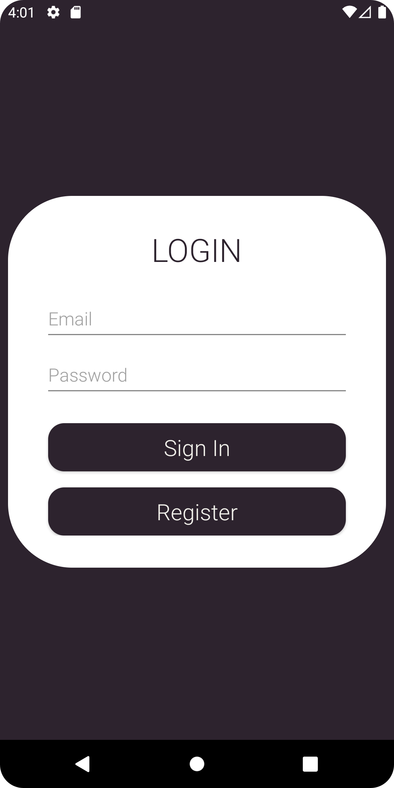
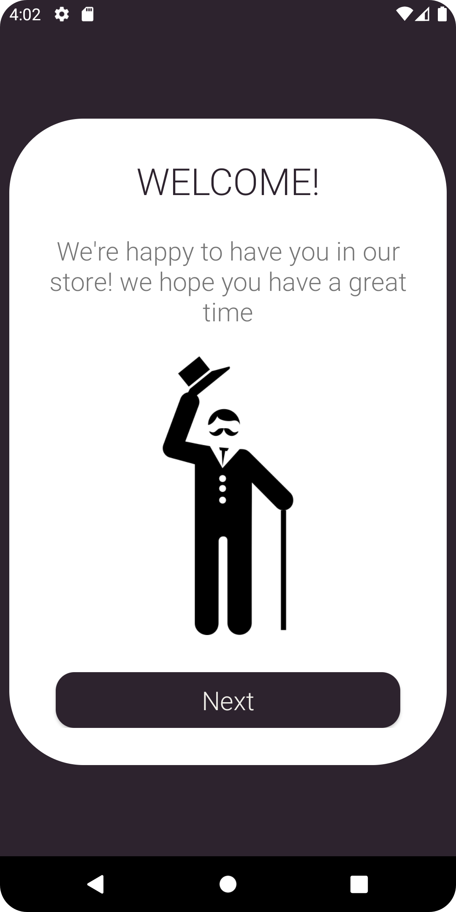
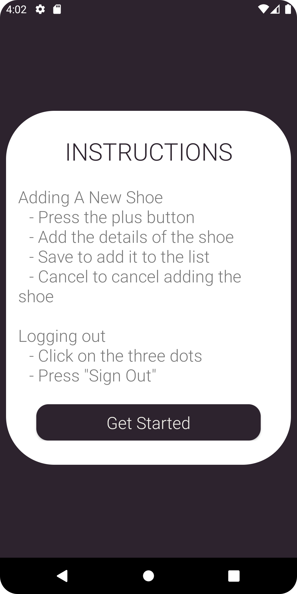
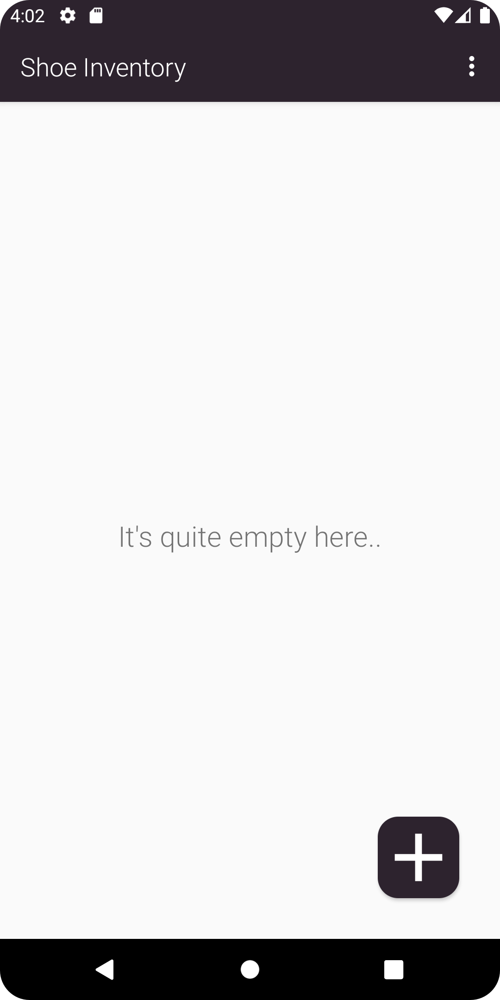
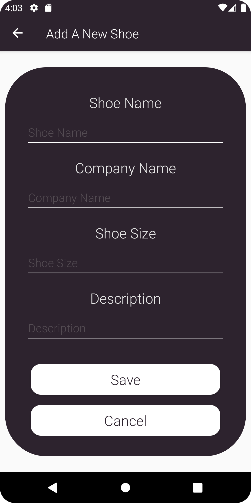

# Shoe Inventory App

Shoe Inventory Application is developed as part of Udacity Nanodegree Android Kotlin Developer Course.
This is aimed to demonstrate full understanding of the following aspect of android development with kotlin :
    * Designing application UI using android layout design e.f Linear layout and Constraint
    * Implementing App navigation across different screens and handling back stack properly
    * Activity and Fragment lifecycle 
    - App Architecture using Android architecture components
        - LiveData
        - ViewModel
    * Using Data binding to reduce boiler code in app.   
    
## The Project consists of the following screens : 

**Login Screen** : Consist of Email and Password fields with simple validation to check if fields are empty

**Welcome OnBoarding Screen**  : Consist of Image view and text field and a button to proceed

**Instruction OnBoarding Screen** : Consist of Image view and text field and a button to proceed

**Shoe Listing Screen** : A LinearLayout inside the ScrollView for Shoe Items and a FloatingActionButton with an action to navigate to the shoe
                   detail screen
                   
**Shoe Detail Screen** : A constraint layout with text field for shoe name, shoe size, shoe description and brand name. An add button to 
add a list of shoe and a cancel button to navigate back to shoe list fragment

## Rubric Adhered
- The Detail screen needs to add the new item to the view model. The listing screen should be listening to that model and show the new item.
- There should only be one activity: MainActivity. Each screen should be a fragment.
- The project's code is error-free.
- The project correctly implements LinearLayout and ConstraintLayout to match the complexity of the layout of a page. Using code comments, the project justifies the use of ConstraintLayout or LinearLayout
- Databinding is set to the appropriate setting in the app build.gradle file and all layout uses the `<layout>` and `<data>` when appropriate.
- The app contains at least 5 screens and they transverse in the correct order :
    - Login
    -  Welcome
    - Instructions screen
    - Listing screen
    - Detail screens
- All click listeners are connected via the DataBindingUtil class and uses the NavController to navigate to the next screen.
- This menu will appear only on the Shoe Listing screen and will return the user to the login screen

### Screenshots

